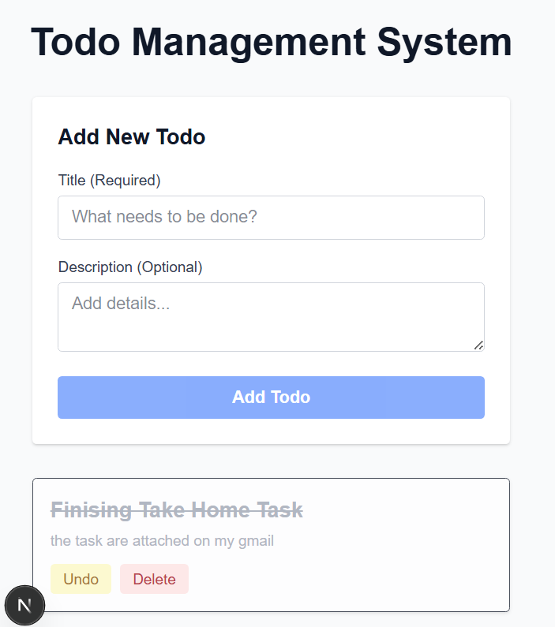

# Todo Management System

A simple full-stack Todo Management application built with Node.js, Express, Sequelize, SQLite, and Next.js. This project demonstrates a basic CRUD (Create, Read, Update, Delete) workflow where users can manage their daily tasks through a clean web interface.

## Features

- View all todos
- Create a new todo
- Mark a todo as completed or undo it
- Delete a todo
- Input validation
- Error handling
- Responsive user interface

## Tech Stack

### Backend
- Node.js
- Express.js
- Sequelize ORM
- SQLite

### Frontend
- Next.js (App Router)
- React
- Tailwind CSS

---

## Project Structure

```
todo-management-system/
│
├── backend/
│   ├── config/
│   ├── controllers/
│   ├── migrations/
│   ├── models/
│   ├── routes/
│   ├── app.js
│   ├── server.js
│   └── package.json
│
├── frontend/
│   ├── src/
│   │   └── app/
│   ├── public/
│   └── package.json
│
└── README.md
```

---

## Installation

Clone the repository.

```bash
git clone https://github.com/tintinbunyispeda/todo-management-system.git

cd todo-management-system
```

---

## Backend Setup

Move to the backend folder.

```bash
cd backend
```

Install dependencies.

```bash
npm install
```

Run database migrations.

```bash
npx sequelize-cli db:migrate
```

Start the backend server.

```bash
npm run dev
```

The backend will run on:

```
http://localhost:5000
```

---

## Frontend Setup

Open a new terminal.

```bash
cd frontend
```

Install dependencies.

```bash
npm install
```

Start the development server.

```bash
npm run dev
```

The frontend will run on:

```
http://localhost:3000
```

---

## API Endpoints

| Method | Endpoint | Description |
|---------|----------|-------------|
| GET | /todos | Get all todos |
| POST | /todos | Create a new todo |
| PUT | /todos/:id | Update a todo |
| DELETE | /todos/:id | Delete a todo |

---

## Todo Object

Example:

```json
{
  "id": 1,
  "title": "Complete assignment",
  "description": "Finish the Todo Management project",
  "completed": false
}
```

---

## Screenshots



---

## Future Improvements

Some possible improvements include:

- Search and filter todos
- Due dates and priorities
- User authentication
- Pagination
- Better UI styling

---

## Author

Cristine Valentina